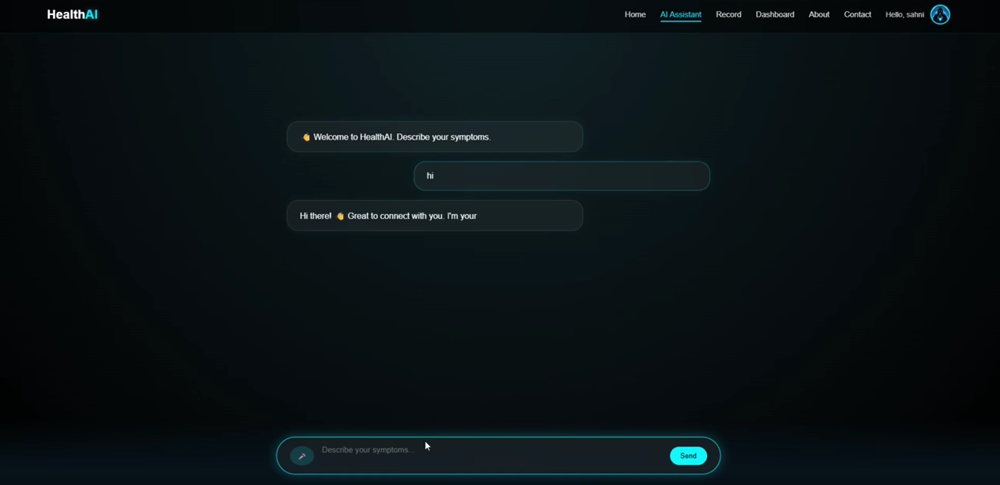
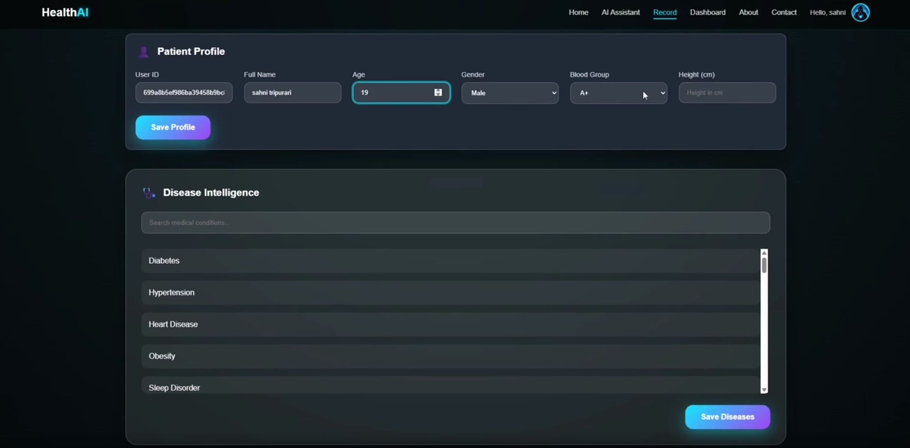

# HealthAI 🩺


> **Your personal AI-powered health companion** — because your health shouldn't wait for an appointment.

---

## 🌟 About

In today's fast-paced world, most people don't have the time to visit a doctor for every symptom or concern. **HealthAI** bridges that gap by putting intelligent health analysis directly in your hands.

Built for everyday users, HealthAI lets you describe your symptoms, select a condition, and receive AI-driven guidance on what steps to take — all from a simple, intuitive interface. No medical jargon. No waiting rooms.

---

## ✨ Features

| Feature | Description |
|--------|-------------|
| 🤖 **AI Health Chat** | Chat with a Gemini-powered assistant about symptoms, conditions, and general health queries |
| 🔍 **Symptom Analyzer** | Select a disease and its associated symptoms — AI generates personalized health recommendations |
| 🦶 **Step Tracker** | Integrates with Google Fit to calculate and monitor your daily footsteps |
| 📋 **Health Report** | Generate a comprehensive health report based on your inputs and history |
| 🔐 **User Auth** | Secure signup and login to keep your health data personal and private |

---

## 🖼️ Screenshots

| Home | AI Assistant |
|------|-------------|
|  |  |

| Patient Records |
|----------------|
|  |

---

## 🛠️ Tech Stack

**Backend**
- Node.js + Express.js
- MongoDB (Database)
- JWT (Authentication)
- Nodemailer (Email service)

**AI & Integrations**
- Google Gemini API (AI health assistant)
- Google Fit API (Step tracking)
- Google OAuth 2.0

**Frontend**
- HTML / CSS / JavaScript

---

## ⚙️ Getting Started

### Prerequisites
- Node.js v18+
- MongoDB URI (local or Atlas)
- Google Gemini API key
- Google Cloud project with Fit API + OAuth enabled

### Installation

```bash
git clone https://github.com/ataraxia-ashish/Health-Project.git
cd Health-Project
npm install
```

### Environment Variables

Create a `.env` file in the root directory:

```env
GEMINI_API_KEY=your_gemini_api_key
MONGO_URI=your_mongodb_connection_string
GOOGLE_CLIENT_ID=your_google_client_id
EMAIL_USER=your_email_address
EMAIL_PASS=your_email_password
JWT_SECRET=your_jwt_secret
PORT=3000
```

### Run

```bash
npm start
```

App runs at `http://localhost:3000`

---

## 👥 Team

| Name |
|------|
| Ashish Makwana |
| Sahani Tripurari |
| Nitesh Yadav |

---

## 📄 License

This project is open source and available under the [MIT License](LICENSE).

---

<p align="center">Built with ❤️ for better health, one chat at a time.</p>
